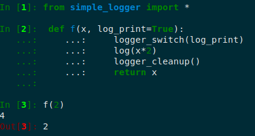

# Simple logger: for easily switching all prints of a function on and off.

I wanted a printing function which could easily be turned off or on.
This is especially useful when debugging, or when one wants to create a function where the user has the option to see the inner workings of the function by using an input variable such as `printing`.

The famous logging module provides a Logger class, but it is an overkill. Using that module, I defined a few functions which do what I wanted:

1. `log` acts as the printing function.
2.  `with_logger` is a function decorator, adding logging functionalities to the ecorated function.

With these one can construct functions with optional logging/printing.

#### Example:

